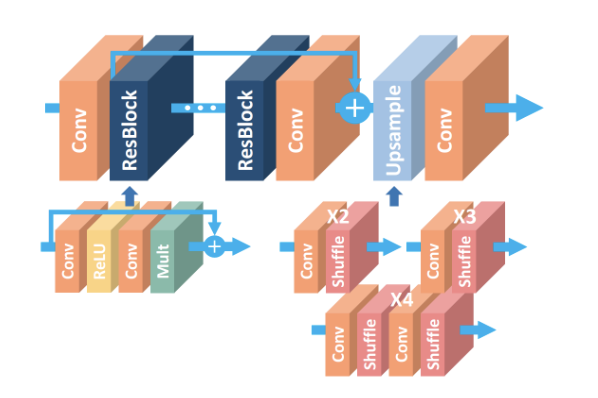
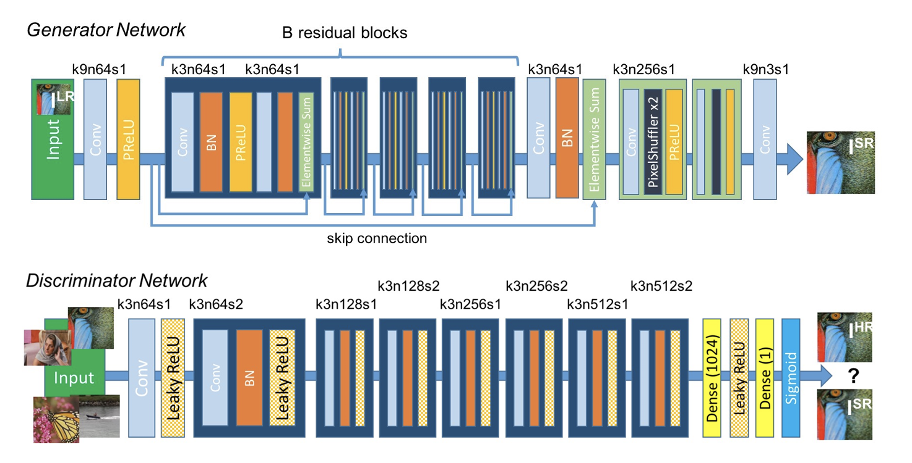
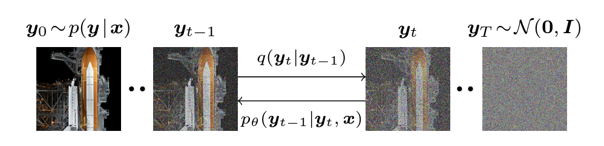
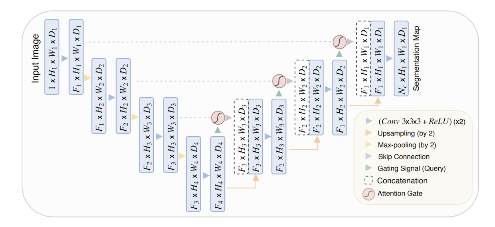
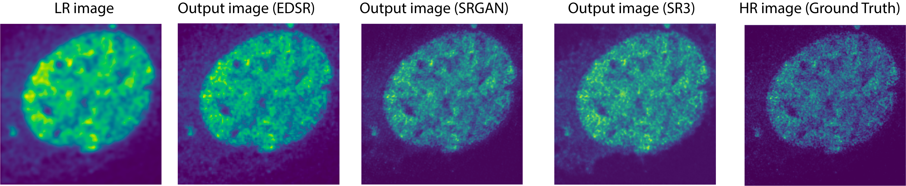
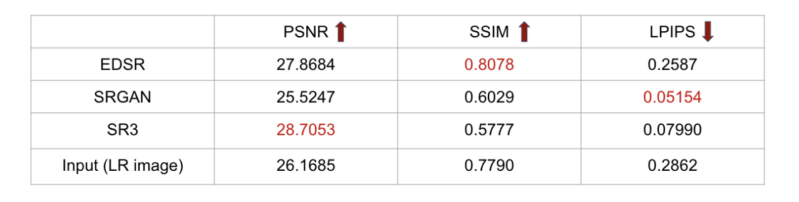

# DeepLearning-Fluorescence-Image-SuperResolution
Being able to improve the resolution of images generated from conventional fluorescence microscopy to match the resolution acquired by super-resolution fluorescence microscopy (2014 Nobel Prize in Chemistry) is greatly useful for scientists to generate insights toward multiple areas such as cell biology and structural biology.

In this project, we compared three deep learning models for fluorescence image super-resolution (SR), including EDSR, SRGAN and SR3 (diffusion). We evaluated these models using three common SR metrics, including SSIM (Structural Similarity Index), PSNR (Peak Signal-to-Noise Ratio), and LPIPS (Learned Perceptual Image Patch Similarity). LPIPS agrees well with human perception of SR fluorescence images and was selected as the final metric for model comparison. SRGAN shows the best performance with the lowest LPIPS score (the lower the better).

## Dataset
The dataset is publicly available (Wang, H. et al. Deep learning enables cross-modality super-resolution in fluorescence microscopy. Nat. Methods 16, 103–110 (2019).), including 55 paired sets of low-resolution images and high-resolution images of fluorescence images of the same field of view. Three different cell organelles images were included, which are cell nuclei, F-actin and microtubule. The low-resolution images were taken from either wide-field fluorescence microscopy or conventional confocal fluorescence microscopy with a spatial resolution of around 280 nm; while the high-resolution images were taken from super-resolution fluorescence microscopy using stimulated emission depletion (STED) with a spatial resolution of around 110nm. All the images are 1024 x 1024.

## Model Architectures
Three models were built and compared for this dataset using PyTorch, including EDSR (enhanced deep residual network), SRGAN (GAN model for SR)  and SR3 (denoising diffusion model for SR) . 
EDSR (B. Lim, S. Son, H. Kim, S. Nah, K.M. Lee, Enhanced Deep Residual Network for Single Image Super-Resolution, CVPR 2017,  arXiv:1707.02921, July 2017):  
  
SRGAN (C. Ledig, L. Theis, F. Huszar, et al (2016). Photo-Realistic Single Image Super-Resolution Using a Generative Adversarial Network. arXiv:1609.04802, Sep 2016.):  
  
SR3 ((Saharia, C., Ho, J., Chan, W., Salimans, T., Fleet, D. J., & Norouzi, M. (2021). Image super-resolution via iterative refinement. ArXiv:2104. 07636)):  
  
  

## Codes
The codes for the three models are in the ./Code folder. Each model has its own .ipynb file.

## Performance
**Qualitative performance:**.  
Some representative output images of all three models are listed below. It can be observed that compared with the low resolution (LR) image, the resolutions of output images in all three models are improved. Compared with the high resolution (HR) image, it can be seen that the out images from SRGAN model have the highest similarity in terms of both resolution and intensity distribution.  
  
**Quantitative performance:**.  
For quantitative performance evaluation, our results supports LPIPS as the best evaluation metric to match human perception, at least for this application.  
  

